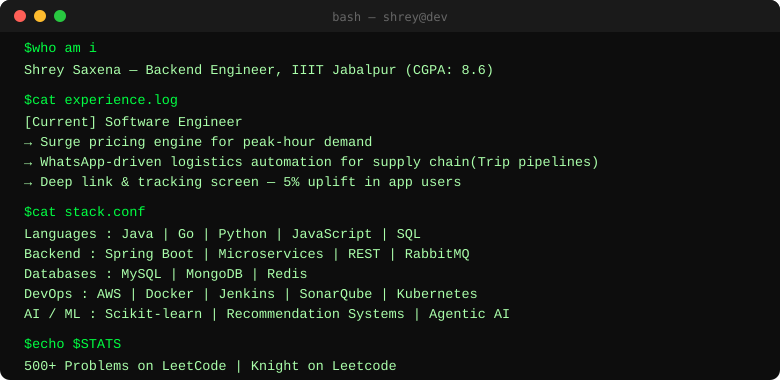

 

---

---

## 🛠️ Tech Stack

**Languages**

**Backend**

**DevOps & Cloud**

**AI / ML**

---

## 🚀 Featured Projects

**🎬 AI Movie Recommendation & Streaming**
`Spring Boot` `RabbitMQ` `MongoDB` `Docker` `AWS` `OAuth2`

Developed and deployed an AI-powered movie recommendation and streaming platform using Spring Boot, RabbitMQ, Docker, and AWS. Improved recommendation latency through asynchronous processing, optimized chunked video streaming, and implemented scalable, secure cloud deployment with CI/CD.

**🏥 Patient Fall Detection & Monitoring**
`Python` `Arduino` `Redis` `Accelerometer`

Developed a real-time hospital patient monitoring system, integrating camera-based AI fall detection with accelerometer sensor data. Led the hardware-software integration layer, enabling reliable cross-verification to reduce false positives.

---

## 📊 GitHub Stats

---

⭐ From [Shrey Saxena](https://github.com/shrey-007)

